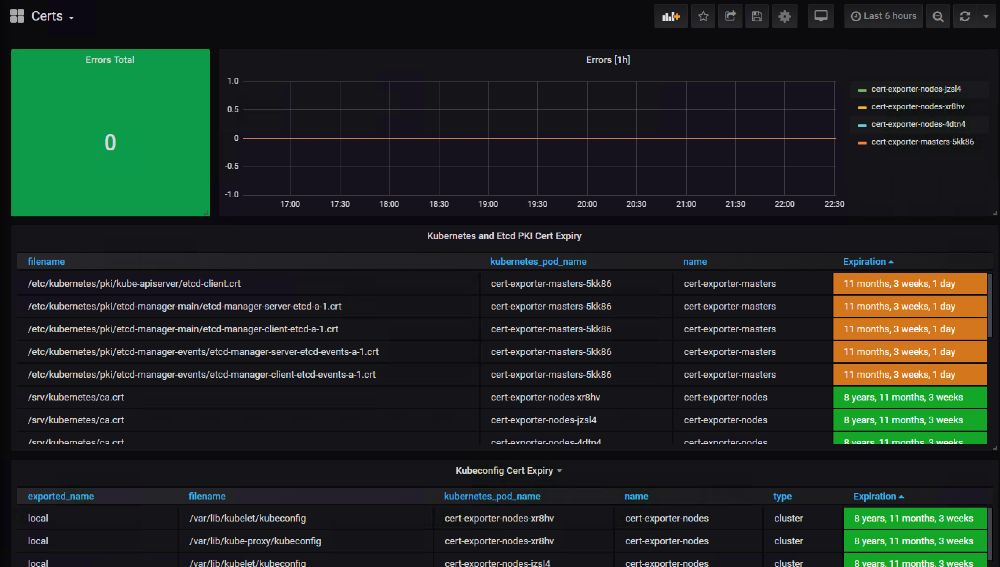

# cert-exporter

Kubernetes uses PKI certificates for authentication between all major components.  These certs are critical for the operation of your cluster but are often opaque to an administrator.  This application is designed to parse certificates and export expiration information for Prometheus to scrape.

### Usage

cert-exporter supports x509 certificates on disk encoded in the [PEM format](https://en.wikipedia.org/wiki/Privacy-Enhanced_Mail) as well as certs embedded or referenced from kubeconfig files.  Certificates are often stored both ways when building clusters.

See [deployment](./docs/deploy.md) for detailed information on running cert-exporter and examples of running it in a [kops](https://github.com/kubernetes/kops) cluster.

### Dashboard

After running cert-exporter in your cluster it's easy to build a [custom dashboard](./docs/sample-dashboard.yaml) to expose information about the certs in your cluster.

### Docs
- [Testing](./docs/testing.md)
  - An overview of the testing scripts and how to run them.
- [Deploy](./docs/deploy.md)
  - Information on how to deploy cert-exporter as well as examples for a kops cluster.